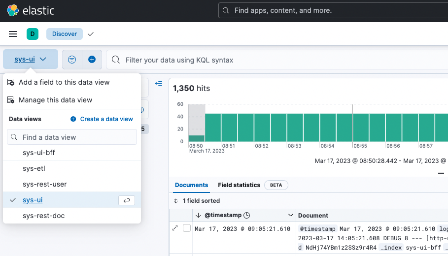

# System Juliet Logging UI

This project represents Kibana Web UI run on Kubernetes via Helm, as a part of the overall https://github.com/jvalentino/sys-juliet project. For system details, please see that location.

Prerequisites

- Git
- Helm
- Minikube

All of these you can get in one command using this installation automation (if you are on a Mac): https://github.com/jvalentino/setup-automation

## Stack

Kibana

> Kibana is an open source data visualization plugin for Elasticsearch. It provides visualization capabilities on top of the content indexed on an Elasticsearch cluster. Users can create bar, line and scatter plots, or pie charts and maps on top of large volumes of data.

https://en.wikipedia.org/wiki/Kibana

## Deployment

Prerequisites

- Elasticsearch must be first running: https://github.com/jvalentino/sys-juliet-logging

To re-install it, forward ports, and then verify it worked, use:

```bash
./deploy.sh
```

The basis of this script is a helm configuration:

**deploy.sh**

```bash
#!/bin/sh

kubectl delete deploy kibana-deployment || true
kubectl delete service kibana || true
kubectl delete configmaps kibana-config || true
kubectl create -f ./config/helm/kibana/deployment.yaml

kubectl wait pods -l app=kibana --for condition=Ready

sh -x ./verify.sh

sh -x ./import.sh
```

...where the verification handles port forwarding and can also be run on its own:

**verify.sh**

```bash
#!/bin/sh
mkdir build || true
kubectl port-forward --namespace default svc/kibana 5601:5601 > build/kibana.log 2>&1 &
curl http://localhost:5601

while [ $? -ne 0 ]; do
    kubectl port-forward --namespace default svc/kibana 5601:5601 > build/kibana.log 2>&1 &
    curl http://localhost:5601
    sleep 5
done
```

Additionally import and export scripts are provided to go about created the appropriate data views automatically.

**export.sh**

```bash
#!/bin/sh
curl -X POST http://localhost:5601/api/saved_objects/_export -H 'kbn-xsrf: true' -H 'Content-Type: application/json' -d '
{
  "type": ["index-pattern", "config", "search"]
}' > config/helm/kibana/data.ndjson
```

**import.sh**

```bash
#!/bin/sh
curl -X POST "http://localhost:5601/api/saved_objects/_import?overwrite=true" -H "kbn-xsrf: true" --form file=@config/helm/kibana/data.ndjson
```

## Configuration

This additionally meant that an entire Kubernetes Deployment, Service, and ConfigMap (for storing a configuration file) was needed:

**config/helm/kibana/deployment.yaml**

```
apiVersion: apps/v1
kind: Deployment
metadata:
  name: kibana-deployment
  labels:
    app: kibana
spec:
  replicas: 1
  selector:
    matchLabels:
      app: kibana
  template:
    metadata:
      labels:
        app: kibana
    spec:
      volumes:
      - name: config-volume
        configMap:
         name: kibana-config
      containers:
      - name: kibana
        volumeMounts:
        - name: config-volume
          mountPath: /usr/share/kibana/config/kibana.yml
          subPath: kibana.yml
        env:
        - name: ELASTICSEARCH_URL
          value: http://elasticsearch-master:9200
        image: docker.elastic.co/kibana/kibana:8.5.1
        ports:
        - containerPort: 5601
          name: webinterface
     
---
apiVersion: v1
kind: Service
metadata:
  name: kibana
  labels:
    service: kibana
spec:
  type: NodePort
  ports:
  - port: 5601
    name: webinterface
  selector:
    app: kibana
---
apiVersion: v1
kind: ConfigMap
metadata:
  name: kibana-config
  labels:
    app: kibana
    env: dev
data:
  kibana.yml: |- 
    server.host: 0.0.0.0
    server.shutdownTimeout: 5s
    elasticsearch.hosts: ['http://elasticsearch-master:9200']
    monitoring.ui.container.elasticsearch.enabled: true
```

That `ConfigMap` magic is just a way of creating the final kibana.yml, and storing it at /usr/share/kibana/config/kibana.yml. This is because without it Kibana requires you to do through a manual setup to connect with Elasticsearch. This means that the content of kibana.yml is:

```
server.host: 0.0.0.0
server.shutdownTimeout: 5s
elasticsearch.hosts: ['http://elasticsearch-master:9200']
monitoring.ui.container.elasticsearch.enabled: true
```

Yes, this is inception levels of embedded YAML.

If it is working, you can see regular pod for Kibana:

[](https://github.com/jvalentino/sys-golf/blob/main/wiki/10.png)

## Runtime

If it worked, you can access the application at [http://localhost:5601](http://localhost:5601/)



You will specifically see the index for each individual application runtime:

- sys-ui-bff - The UI BFF
- sys-etl - The ETL application
- sys-rest-user - The RESTful services related to the user
- Sys-ui - The React frontend on nginx
- Sys-rest-doc - The RESTful services related to documents

